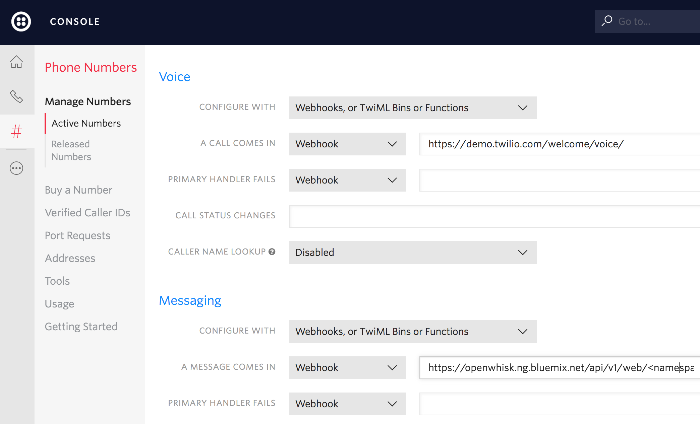

## 자연어 인터페이스 기반의 홈오토메이션

*다른 언어로 보기: [English](README.md).*

지난 몇 년 동안 Apple Siri, Amazon Alexa 및 Google Assistant 등의 지능형 개인 비서의 인기가 크게 증가했습니다. 이러한 앱들은 초창기에는 신기한 장난감 정도로 인식되었지만, 이제는 서비스 API 및 IoT 연결 디바이스와 상호작용하는 편리한 인터페이스로 발전했습니다. 이 개발 과정은 Raspberry Pi를 사용하여 전원 콘센트를 껐다가 켜서 사용자가 자체 홈 허브를 설정하는 방법을 배우게됩니다. 회로 및 소프트웨어 의존성이 올바르게 설치되고 구성되면 IBM Watson의 언어 서비스를 사용하여 음성 또는 텍스트 명령으로 전원 콘센트를 제어할 수 있게 됩니다. 또한 OpenWisk 서버리스 기능을 사용하여 예정된 스케줄, 기상 변화, 동작 센서 활성화 등을 기반으로 이러한 소켓을 트리거하는 방법을 보여줍니다. 

### 아키텍처


*아키텍처 구성도*
1.	사용자는 마이크에 대고 명령을 말하거나 Twilio SMS 번호로 텍스트를 보냅니다
2.	해당 명령이 캡처되어 OpenWhisk 시퀀스를 트리거하는 HTTP POST 요청에 임베드됩니다
3.	OpenWhisk 액션 1은 오디오를 Bluemix Speech to Text 서비스로 전달하고 응답을 기다립니다
4.	텍스트화된 명령은 OpenWhisk 액션 2로 전달됩니다
5.	OpenWhisk 액션 2는 Conversation 서비스를 호출하여 사용자의 텍스트 명령을 분석한 다음 응답을 기다립니다
6.	Conversation 서비스 결과는 최종 OpenWhisk 액션으로 전달됩니다
7.	Openwhisk 액션은 IoT MQTT 브로커에 엔티티 / 인텐트 페어(예 : "fan / turnon")를 게시합니다
8.	MQTT 브로커에 등록된 Raspberry Pi는 결과를 수신합니다
9.	Raspberry Pi는 RF 신호를 전송하여 콘센트를 켜거나 끕니다

<!-- TODO, test all links -->
### 설정 단계
- [하드웨어 연결 및 구성](#하드웨어-부품-설정하기)
  * RF 회로 조립
  * 소프트웨어 의존성 + 라이브러리 설치
  * 무선 소켓에 해당하는 RF 코드 캡처
- [Bluemix 서비스 제공하기](#플랫폼-서비스-제공-및-설정하기)
- [서버리스 기능 생성하기](#openwhisk)
- [Bluemix에 배포하기](#bluemix)

## 하드웨어 부품 설정하기

RF 회로를 조립하고 구성부터 시작하겠습니다. 이 회로에는 다음 구성 요소가 필요합니다
- [Raspberry Pi 3](https://www.raspberrypi.org/products/raspberry-pi-3-model-b/)
- [GPIO 리본 케이블 + 브레이크아웃 보드](https://www.adafruit.com/product/914)
- [433MHz RF 송신기 및 수신기](https://www.amazon.com/SMAKN%C2%AE-433Mhz-Transmitter-Receiver-Arduino/dp/B00M2CUALS)
- [Etekcity 433 MHz 아웃렛](https://www.amazon.com/Etekcity%C2%AE-Wireless-Control-Switches-included/dp/B00DQELHAE/)
- [브레드보드](https://www.adafruit.com/product/239)
- [USB 마이크](https://www.amazon.com/eBerry-Adjustable-Microphone-Compatible-Recording/dp/B00UZY2YQE/ref=sr_1_9?ie=UTF8&qid=1497828013&sr=8-9&keywords=usb+microphone)

모든 부품을 준비하신 후 조립하여 아래 회로를 구성하십시오. 이 회로에는 GPIO 리본 / 브레이크아웃 보드를 통해 브레드보드에 연결된 Raspberry Pi가 포함됩니다.


<!-- Transmitter/Receiver datasheet http://www.mantech.co.za/Datasheets/Products/433Mhz_RF-TX&RX.pdf -->

<!-- <p align="center">

</p> -->

브레이크아웃 보드의 왼쪽에 있는 빨간색 전선은 Raspberry Pi에서 브레드보드의 전원 레일 중 하나로의 5V 브리징을 합니다. 다이어그램의 오른쪽 하단에 있는 추가 빨간색 전선은 파워 레일에서 RF 수신기 및 송신기로 5 볼트를 공급합니다. 흰색 전선도 유사한 개념이지만, 이 와이어는 일반적으로 "접지"로 불리는 음전하를 제공합니다. 다음으로, 초록색 전선은 Raspberry Pi의 GPIO 핀 17을 트랜스미터의 데이터 핀에 연결하고 검은색 전선은 GPIO 핀 27을 수신기의 데이터 핀에 연결합니다. 그 이유는 아래 이미지 `gpio readall` 출력에서 볼 수 있듯이, BCM 17에 매핑되는 송신기가 [wiringPi pin 0](https://github.com/ninjablocks/433Utils/blob/master/RPi_utils/codesend.cpp#L27)을 기본값으로하기 때문에 BCM 27에 매핑되는 수신기는 [wiringPi pin 2](https://github.com/ninjablocks/433Utils/blob/master/RPi_utils/RFSniffer.cpp#L25)로 기본 설정됩니다. 이러한 기본 핀은 433Utils 라이브러리의 링크된 파일 중 하나를 수정하고 라이브러리를 다시 컴파일하여 변경할 수 있습니다.

일단 Raspberry Pi가 회로에 연결되면 RF 송신기 및 수신기와 상호 작용할 수 있도록 종속적인 소프트웨어를 설치해야합니다. 이는 [install_deps.sh] (./iot- gateway / install_deps.sh) 스크립트를 실행하여 수행할 수 있습니다.

여기에 설치되는 오픈소스 라이브러리는 [wiringPi] (http://wiringpi.com/) 및 [433Utils] (https://github.com/ninjablocks/433Utils)입니다. wiringPi를 사용하면 응용 프로그램에서 Raspberry Pi의 GPIO 핀을 읽고 제어할 수 있습니다. 433Utils는 433MHz 주파수로 메시지를 송수신하기 위해 wiringPi 라이브러리를 호출합니다. 이 예제의 경우, 각 콘센트에는 전원을 켜고 끌 수 있는 고유한 RF 코드가 있습니다. 각각의 고유 코드를 필수적으로 등록하기 위해 "RFSniffer"라는 wiringPi 유틸리티 중 하나를 사용합니다. 433MHz 주파수는 온도 조절기, 창문/문 센서, 자동차 키 등과 같은 많은 일반 디바이스에서 표준으로 쓰입니다. 따라서 이 초기 설정은 전원 콘센트 제어에만 국한되는 것은 아닙니다.

스크립트가 완료되면 `gpio readall`을 실행하여 wiringPi가 성공적으로 설치되었는지 확인하십시오. 다음 차트가 표시되어야합니다.
<p align="center">

</p>

이제 어떤 RF 코드가 Etekcity 전원에 해당하는지 확인할 수 있습니다. 아래 코드를 실행해서 시작하세요. 
```
sudo /var/www/rfoutlet/RFSniffer
```

그러면 RF 수신기에서 들어오는 신호를 수신하여 표준 출력에 씁니다. Etekcity 리모컨의 켜기/끄기 버튼을 누르면 회로가 올바르게 배선된 경우 Raspberry Pi에 다음이 나타납니다.
```
pi@raspberrypi:~ $ sudo /var/www/rfoutlet/RFSniffer
Received 5528835
Received pulse 190
Received 5528844
Received pulse 191
```

RF 소켓의 on/off 신호를 결정한 후, 캡처된 신호를 / etc / environment 파일에 배치하십시오.
```
RF_PLUG_ON_1=5528835
RF_PLUG_ON_PULSE_1=190
RF_PLUG_OFF_1=5528844
RF_PLUG_OFF_PULSE_1=191
```

이제 연결된 소켓을 연결하고 다음 명령을 실행하여 Raspberry Pi가 소켓을 켜고 끌 수 있는지 확인하십시오. 이 명령은 요청된 펄스 길이로 RF 코드를 보내며, 이는 -l 파라미터로 제공됩니다.

```
source /etc/environment
/var/www/rfoutlet/codesend ${RF_PLUG_ON_1} -l ${RF_PLUG_ON_PULSE_1}
/var/www/rfoutlet/codesend ${RF_PLUG_OFF_1} -l ${RF_PLUG_OFF_PULSE_1}
```

이제는 cli를 통해 소켓을 수동으로 제어할 수 있기 때문에, 이 과정에서는 여러 가지 자동화된 방법으로 제어하는 것을 시도해 보겠습니다. Raspberry Pi에서 파이프라인과 복잡한 자동화 로직을 작성하고 실행하는 대신 Openwhisk라는 서버리스 이벤트-기반 플랫폼을 활용할 것입니다. 이 구현에서 Openwhisk 액션은 MQTT 메시지를 통해 Raspberry Pi와 통신합니다.

### 오디오 인터페이스
일단 Raspberry Pi가 설정되면 USB 마이크의 오디오 입력을 인식하도록 설정해야 합니다. 필요한 경우에만 오디오를 녹음하고 텍스트화하기 위해 [Snowboy] (https://snowboy.kitt.ai/)라는 "Hotword"검색 서비스를 활용하여 특정 음성 패턴 (이 예제의 경우,** Hello Watson**)을 선택하고 핫 워드 패턴이 감지되면 녹음을 시작합니다. 음성 모델을 만드는 데 필요한 단계는 [여기](http://docs.kitt.ai/snowboy/)에서 찾을 수 있습니다.


## 플랫폼 서비스 제공 및 설정하기
- [Conversation](https://console.bluemix.net/catalog/services/conversation)
- [Speech to Text](https://console.bluemix.net/catalog/services/speech-to-text)
- [Watson IoT Platform](https://console.bluemix.net/catalog/services/internet-of-things-platform)
- [Twilio](https://console.bluemix.net/catalog/services/twilio)
<!-- - [Openwhisk](https://console.bluemix.net/openwhisk) -->

이러한 서비스를 제공하려면 Bluemix 계정이 필요합니다. 로그인 한 후, 위의 각 링크를 탐색하고 "서비스 생성"버튼을 선택하십시오.

*서비스 생성*
<p align="center">

</p>

### Conversation
[Conversation](https://www.ibm.com/watson/developercloud/conversation.html) 서비스는 자연어를 분석하고 사용자 입력을 기반으로 수행할 액션을 결정합니다. 여기에는 두 가지 주요 개념이 있습니다. 첫째는 "Intents"(의도)인데, 이는 사용자가 응용 프로그램을 수행할 내용을 결정합니다. 둘째는 "Entities"인데 intents(의도)가 어디에 적용되어야 하는지에 대한 컨텍스트를 제공합니다. 이 예제에서는 간단한 두 가지 intents(의도)가 있습니다. 하나는 "끄다"이고, 다른 하나는 "켜다"입니다. 그리고 3 개의 entities(엔티티)를 가지고 있습니다. 이 경우 엔티티는 켜고 끄기를 원하는 가정용 디바이스입니다. 이 사전교육된 데이터 모델은 UI를 통해 프로비저닝된 Coversation 서비스에 업로드할 수 있습니다. 업로드를 시작하려면 Bluemix에 로그인하십시오. 그런 다음 대화 서비스를 선택한 다음 "Launch Tool"버튼을 선택하십시오.

### Watson IoT Platform
Watson IoT Platform은 MQTT 메시징 브로커로 활용됩니다. 이것은 전화, 랩탑 및 마이크와 같은 다양한 장치가 Raspberry Pi와 통신할 수 있게 해주는 publish/subscribe 메시징 프로토콜입니다. 이 서비스가 프로비저닝되면 MQTT 브로커에 안전하게 액세스하기 위한 신임정보를 생성해야 합니다. 이러한 단계는 [여기](./ iot-gateway /) 에서 확인하실 수 있습니다.

### Openwhisk
Raspberry Pi에서 파이프라인 및 복잡한 자동화 로직을 작성하고 실행하는 대신 서버리스 이벤트 기반 플랫폼인 [Openwhisk](https://console.ng.bluemix.net/openwhisk) 를 활용할 것입니다. Openwhisk 액션은 결과를 MQTT 메시지로 Raspberry Pi에 전달합니다. Openwhisk는 코드 스니펫을 REST API 엔드 포인트에 바인딩할 수 있는 서버리스 프레임워크입니다. 일단 작성되면 인터넷에 연결된 모든 디바이스에서 직접 실행하거나 데이터베이스 변경 또는 특정 MQTT 채널로 들어오는 메시지와 같은 이벤트에 응답할 수 있습니다. 이러한 스니펫 또는 "액션"이 생성되면 위의 아키텍처 다이어그램과 같이 시퀀스로 함께 연결될 수 있습니다.

우선, 세 가지 액션으로 구성된 시퀀스를 만듭니다. 첫 번째 액션은 오디오 페이로드를 텍스트로 변환합니다. 두 번째 액션은 Conversation 서비스를 사용하여 문자 메시지 결과를 분석합니다. 이 분석은 음성 메시지의 의도를 추출하고, Raspberry Pi가 무엇을 하길 사용자가 원한 것인지에 대해 결정합니다. 예를 들어, 사용자가 "전등 켜기"또는 "스위치 누르기"의 행을 따라 뭔가를 말하면 NLC 서비스가 이를 해석할 수 있습니다. 마지막으로, 세 번째 액션은 MQTT 메시지를 보내서 Raspberry Pi에게 소켓을 켜고 끌 것을 알립니다

Speech to text 액션은 OpenWisk에 공개 패키지로 이미 들어 있으므로 해당 서비스에 대한 신임정보를 제공하면 됩니다. 향후에는 다음 명령을 사용하여 추가 작업을 진행할 수 있습니다.

```
cd serverless-home-automation/iot_gateway/whisk_actions
wsk action create conversation conversation.js
wsk action create parser-python parser-python.py
```

액션이 성공적으로 수행되면 각 작업에 대한 기본 서비스 신임정보를 설정할 수 있습니다. 그렇지 않으면, 액션에서 Watson 서비스를 호출할 때마다 서비스 신임정보를 전달해야 합니다. 이러한 신임정보를 얻으려면 Bluemix 대시보드에서 제공된 각 서비스를 클릭한 다음 "신임정보 보기"를 클릭하십시오.

<p align="center">

</p>

그런 다음 아래 명령을 실행할 때 해당 신임정보를 넣으십시오.

```
wsk action update conversation -p username ${conversation_username} -p password ${conversation_password} -p workspace_id ${conversation_workspace_id}
wsk action update parser-python -p org ${iot_org_id} -p device_id ${device_id} -p api_token ${api_token}
wsk package bind /whisk.system/watson-speechToText myWatsonSpeechToText -p username ${stt_username} -p password ${stt_password}
```

다음으로, 액션을 시퀀스로 배열할 수 있습니다.
```
wsk action create homeSequence --sequence /myWatsonSpeechToText/speechToText,conversation,parser-python
```

<!-- TODO, update node server with multi devices from Pi -->
시퀀스가 Raspberry Pi에 결과를 리턴할 수 있으려면 MQTT 클라이언트가 Watson IoT 서비스에 등록(subscribe)되어야 합니다. / etc / environment 파일에 적절한 값이 설정되어 있으면 다음 명령을 실행하여 부팅할 때 자동으로 시작될 systemd 서비스를 만들고 활성화해야합니다. 그러면 Watson IoT Platform의 MQTT 브로커에 등록되고 intents와 엔티티 페어를 수신 대기하는 [노드 서버](./iot- gateway / node-mqtt.js)가 시작됩니다.

```
sudo cp serverless-home-automation/iot-gateway/node-mqtt.service /etc/systemd/system/
sudo systemctl enable node-mqtt
sudo systemctl start node-mqtt
sudo systemctl status node-mqtt
```

### Twilio
Twilio는 개발자가 VoIP 및 SMS 기능을 플랫폼에 통합할 수 있게 하는 서비스입니다. 이는 개발자가 등록할 전화번호를 선택할 수 있게하여 작동합니다. Twilio는 일단 등록하면, API 엔드 포인트를 공개하여 전화와 문자를 프로그래밍 방식으로 만들 수 있도록 번호를 설정할 수 있습니다. 또한, 그 번호는 웹훅webhook을 트리거하거나 [Twiml](https://www.twilio.com/docs/api/twiml) 문서를 따라 수신되는 전화/텍스트에 응답하도록 설정할 수 있습니다. 이 경우, 이전 단계에서 만든 "homeSequence" Openwhisk 액션에 바인딩된 웹훅을 트리거하여 수신되는 텍스트에 응답하도록 Twilio 번호를 설정합니다. [Openwhisk 콘솔](https://console.bluemix.net/openwhisk/editor)로 이동하여 homeSequence 시퀀스를 선택한 다음 "View Action Details"버튼을 선택하여 웹훅에 대한 URL을 찾을 수 있습니다. 마지막으로 "Enable as Web Action"버튼을 선택하고 생성된 웹 액션 URL을 복사합니다. 

우선, Twilio의 [등록 페이지](https://www.twilio.com/try-twilio) 를 방문하십시오. 가입한 후 로그인하여 메뉴에서 # 아이콘을 선택하면 브라우저가 [전화번호](https://www.twilio.com/console/phone-numbers/incoming) 설정페이지로 이동합니다. 이제 동그란 + 버튼을 선택하여 번호를 선택하고 등록하십시오. 등록한 후 번호를 클릭하여 구성하십시오. 아래로 스크롤하면 '메시징'섹션이 표시됩니다. "A Message Comes in"이라는 제목의 양식에서 아래 보이는 "homeSequence"Openwhisk 액션과 관련된 웹훅을 붙여 넣으십시오.

<p align="center">

</p>

### Node Red
Openwhisk에서 시퀀스를 생성하는 방법 대신, 홈오토메이션 로직을 [Node Red](https://github.com/node-red/node-red)를 사용하여 구성할 수 있습니다. Node Red는 사용자가 코드 또는 서비스 호출의 "블록"을 끌어다 놓고 연결할 수 있게함으로써 "흐름"을 조합할 수있는 비주얼 편집기입니다. 이 배포 방식은 노드 서버로 계속해서 실행되므로 서버리스 모델을 적용하지 않을 것입니다. 백엔드 로직은 모두 Openwhisk 서버리스 액션 풀에 있기 때문에 장기 실행(long running) 서버를 설정하지 않고도 SMS 또는 음성을 통해 디바이스를 제어할 수 있어야합니다. 그러나 Node Red를 사용하고 싶은 경우,`npm install node-red`를 통해 패키지를 설치하고,`node-red`를 통해 편집기를 부팅하고, 아래의 다이어그램과 같은 흐름을 생성할 수 있습니다. 흐름을 연결한 후에는, 각 블록에 인증 신임정보와 엔드포인트를 덧붙여야합니다.


<!-- <p align="center">

</p> -->

Node Red 인스턴스를 Bluemix에 배포하려면, 아래 버튼을 클릭하십시오

[](https://bluemix.net/deploy?repository=https://github.com/kkbankol-ibm/node-red-bluemix-starter.git)

[Sample Bluemix Instance](http://serverless-home-automation.mybluemix.net/red/#flow/e711dbd4.4e7d18)


### 문제 해결

RC 회로:
각각의 전선이 올바르게 정렬되었는지 확인한 후 [멀티미터](https://learn.sparkfun.com/tutorials/how-to-use-a-multimeter)를 사용하여 전원에서 시작하여 각 연결 노드를 점검하십시오. 예를 들어, RF 부품의 전원이 올바르게 공급되는지 확인하려면 멀티미터의 음극/접지 단자를 접지된 전원 레일에 연결하고 멀티미터의 양극 끝을 RF 부품 5V 핀에 연결하십시오.

Bluemix 서비스:
Bluemix 구성 요소(음성, 텍스트, 회화 등)가 응답하지 않는 것처럼 보이면 [Bluemix 상태 페이지](https://status.ng.bluemix.net/)에서 서비스가 다운되었거나 보수 중인지 확인하십시오. 그렇지 않다면 curl을 사용하여 샘플 요청을 하고 200 HTTP 응답이 리턴되는지 확인하십시오. speech-to-text서비스에 대한 샘플 요청은 아래 예시와 같습니다. 
```
curl -v -u ${username}:${password} https://stream.watsonplatform.net/speech-to-text/api/v1/models
```

Openwhisk:
`wsk -vvv action list` 를 보려면, 아무 wsk 명령에 -vv를 추가하십시오.
또한, [Openwhisk dashboard](https://console.bluemix.net/openwhisk/dashboard) 에서 활동 로그를 확인하십시오

Raspberry Pi:
`journalctl -ru node-mqtt`를 실행하여 Raspberry Pi의 노드 서버의 stdout 및 stderr 출력을 봅니다.

Twilio:
수신/발송되는 SMS 메시지에 대한 출력을 보려면 [Twilio logging](https://www.twilio.com/console/sms/logs) 을 방문

# License
[Apache 2.0](LICENSE)
