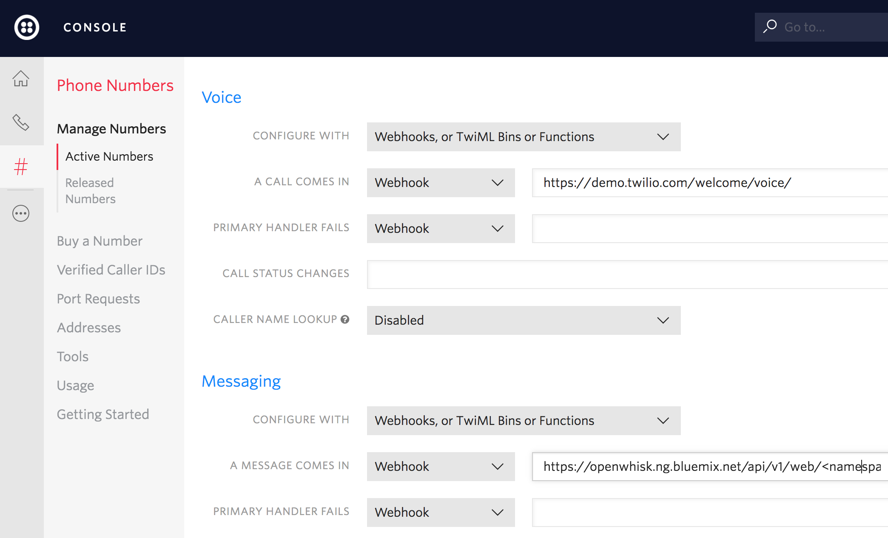

## Natural Language Interface based Home Automation

*View this in other languages: [한국어](README-ko.md).*

> Watson Conversation is now Watson Assistant. Although some images in this code pattern may show the service as Watson Conversation, the steps and processes will still work.

## Overview and goal
Over the past few years, we’ve seen a significant rise in popularity for intelligent personal assistants, such as Apple’s Siri, Amazon Alexa, and Google Assistant. Though they initially appeared to be little more than a novelty, they’ve evolved to become rather useful as a convenient interface to interact with service APIs and IoT connected devices. This developer pattern will guide users through setting up their own starter home automation hub by using a Raspberry PI to turn power outlets off and on. Once the circuit and software dependencies are installed and configured properly, users will also be able to leverage Watson’s language services to control the power outlets via voice and/or text commands. Furthermore, we’ll show how IBM Cloud Functions serverless functions can be leveraged to trigger these sockets based on a timed schedule, changes to the weather, motion sensors being activated, etc.

Audience level: Intermediate. User will need basic hardware skills to assemble electronic circuits on a breadboard, and be somewhat familiar with a Linux terminal to install Raspberry Pi dependencies.

IBM Cloud Plans: This project will work with the Free/Lite version of all required services: Speech To Text, Text To Speech, Watson Assistant, and IBM Cloud Functions.

Click here to view the [IBM Pattern](https://developer.ibm.com/code/patterns/implement-voice-controls-for-serverless-home-automation-hub/) for this project.

## Prerequisites
You will need the following accounts and tools:
* [IBM Cloud account](https://console.ng.bluemix.net/registration/)
* [IBM Cloud CLI](https://console.bluemix.net/docs/cli/reference/bluemix_cli/all_versions.html#ibm-cloud-cli-installer-all-versions)
* [Openwhisk CLI](https://github.com/apache/incubator-openwhisk-cli/releases)

### Architecture

*Architecture flow*
1.	User says a command into the microphone, or sends a text to the Twilio SMS number
2.	User input is captured and embedded in an HTTP POST request triggering an IBM Cloud Functions sequence
3.	The first IBM Cloud Functions action in the sequence forwards the audio to Speech to Text service, and waits for the response
4.	Transcription is forwarded to the second IBM Cloud Functions action
5.	IBM Cloud Functions action 2 calls the Watson Assistant service to analyze the user's text input, again waits for the response
6.	Watson Assistant service result is forwarded to final IBM Cloud Functions action
7.	Final IBM Cloud Functions action publishes a entity/intent pair (fan/turnon for example) to the IoT MQTT broker
8.	MQTT client subscribed on Raspberry Pi receives and interprets result
9.	Raspberry Pi transmits corresponding RF signal to adjust outlet state

<!-- TODO, test all links -->
## Steps
- [Connect And Configure Hardware](#configure-hardware-components)
  * Assemble RF Circuit
  * Install Software Dependencies + Libraries
  * Capture RF codes corresponding to wireless sockets
- [Provision IBM Cloud Services](#provision-and-configure-platform-services)
- [Create Serverless Functions](ibm_cloud_functions)
- [Deploy to IBM Cloud](#bluemix)

* **Configure Hardware Components**

We can get started by assembling and configuring the RF circuit. This circuit requires the following components
- [Raspberry PI 3](https://www.raspberrypi.org/products/raspberry-pi-3-model-b/)
- [GPIO Ribbon cable + Breakout Board](https://www.adafruit.com/product/914)
- [433MHz RF transmitter and receiver](https://www.amazon.com/SMAKN%C2%AE-433Mhz-Transmitter-Receiver-Arduino/dp/B00M2CUALS)
- [Etekcity 433 MHz Outlets](https://www.amazon.com/dp/B00DQELHBS)
- [Electronic Breadboard](https://www.adafruit.com/product/239)
- [USB Microphone](https://www.amazon.com/eBerry-Adjustable-Microphone-Compatible-Recording/dp/B00UZY2YQE/ref=sr_1_9?ie=UTF8&qid=1497828013&sr=8-9&keywords=usb+microphone)

Once all components have been obtained, assemble them to form the circuit below. In this circuit, we have the Raspberry Pi connected to the electronic breadboard via the GPIO ribbon/breakout board.


<!-- Transmitter/Receiver datasheet http://www.mantech.co.za/Datasheets/Products/433Mhz_RF-TX&RX.pdf -->

<!-- <p align="center">

</p> -->

The red wire just left of the breakout board is responsible for bridging 5 volts from the Raspberry Pi to one of the breadboard's power rails. The additional red wires to the bottom right of the diagram supply those 5 volts from the power rail to the RF receiver and transmitter. Similar concept for the white wires, except those provide a negative charge, commonly referenced to as "ground". Next, we have the green wire that connects the Raspberry Pi's GPIO pin 17 to the transmitter's data pin, and the black wire connects the GPIO pin 27 to the receiver's data pin. The reason for this can be seen in the `gpio readall` output in image below, as the transmitter defaults to [wiringPi pin 0](https://github.com/ninjablocks/433Utils/blob/master/RPi_utils/codesend.cpp#L27) which maps to BCM 17, and the receiver defaults to [wiringPi pin 2](https://github.com/ninjablocks/433Utils/blob/master/RPi_utils/RFSniffer.cpp#L25), which maps to BCM 27. These default pins can be changed by modifying either of the linked files in the 433Utils library, and recompiling the library.

Once the Raspberry Pi is connected to the circuit, we'll need to install dependencies to allow us to interact with the RF transmitter and receiver. This can be accomplished by running the [install_deps.sh](./iot-gateway/install_deps.sh) script.

The open source libraries that are being installed here are [wiringPi](http://wiringpi.com/) and [433Utils](https://github.com/ninjablocks/433Utils). wiringPi enables applications to read/control the Raspberry Pi’s GPIO pins. 433Utils calls the wiringPi library to transmit and receive messages via the 433MHz frequency. In our case, each outlet has a unique RF code to turn power on and off. We’ll use one of the wiringPi utilities, titled “RFSniffer” to essentially register each of these unique codes. The 433MHz frequency is standard among many common devices such as garage door openers, thermostats, window/door sensors, car keys, etc. So this initial setup is not limited to only controlling power outlets.

Once the script completes run `gpio readall` to ensure that wiringPi installed successfully. The following chart should be displayed.
<p align="center">

</p>

Now we can determine which RF codes correspond with the Etekcity outlets. Start by executing
```
sudo /opt/433Utils/RPi_utils/RFSniffer
```

This will listen on the RF receiver for incoming signals, and write them to stdout. As the on/off buttons are pressed on the Etekcity remote, the Raspberry Pi should show the following output if the circuit is wired correctly.
```
pi@raspberrypi:~ $ sudo /opt/433Utils/RPi_utils/RFSniffer
Received 5528835
Received pulse 190
Received 5528844
Received pulse 191
```

After determining the on/off signal for the RF sockets, place the captured signals into the `/etc/environment` file like so.
```
RF_PLUG_ON_1=5528835
RF_PLUG_ON_PULSE_1=190
RF_PLUG_OFF_1=5528844
RF_PLUG_OFF_PULSE_1=191
```

Now, plug in the associated socket, and run the following command to ensure the Raspberry Pi can turn the socket on and off. This command simply sends the RF code at the requested pulse length, which is to be provided as the `-l` parameter.

```
source /etc/environment
/opt/433Utils/RPi_utils/codesend ${RF_PLUG_ON_1} -l ${RF_PLUG_ON_PULSE_1}
/opt/433Utils/RPi_utils/codesend ${RF_PLUG_OFF_1} -l ${RF_PLUG_OFF_PULSE_1}
```

Now that we can control the sockets manually via cli, we’ll move forward and experiment with different ways to control them in an automated fashion. Rather than writing and executing pipelines and complex automation logic on the Raspberry Pi, we’ll utilize a serverless, event driven platform called IBM Cloud Functions. In this implementation, IBM Cloud Functions actions communicate with the Raspberry Pi via MQTT messages.

* **Audio Interface**

Once the Raspberry Pi is setup, we'll need to configure it to recognize audio input from the USB microphone. To ensure that audio is recorded and transcribed only as needed, we'll leverage a "Hotword" detection service named [Snowboy](https://snowboy.kitt.ai/), which listens for a specific speech pattern (**Hello Watson**, in this case), and begins recording once the hotword pattern is detected. The steps required to create a voice model can be found [here](http://docs.kitt.ai/snowboy/).

* **Provision and Configure Platform Services**

- [Watson Assistant](https://console.bluemix.net/catalog/services/conversation)
- [Speech to Text](https://console.bluemix.net/catalog/services/speech-to-text)
- [Watson IoT Platform](https://console.bluemix.net/catalog/services/internet-of-things-platform)
- [Twilio](https://console.bluemix.net/catalog/services/twilio)
<!-- - [IBM Cloud Functions](https://console.bluemix.net/openwhisk) -->

A IBM Cloud Account is required to provision these services. After logging in, simply navigate to each of the links above, and select the "Create Service" button.

*Create Service*
<p align="center">

</p>

* **Watson Assistant**

The [Watson Assistant](https://www.ibm.com/watson/developercloud/conversation.html) service is used to analyze natural language and determine which action(s) to take based on the user input. There are two main concepts to understand here. The first are referred to as "Intents", which determine what the user would like the application to do. Next, we have "Entities", which provide context of where the intent should be applied. To keep things simple, we have two intents, one is titled "turnoff", the other "turnon". Next, we have 3 entities, which are household devices that we'd like to turn off and on in this case. This pre-trained data model can be uploaded to the provisioned Watson Assistant service through the UI. To initiate the upload, login to the IBM Cloud console. Next select the Watson Assistant service, and then the button titled "Launch Tool".

* **Watson IoT Platform**

The Watson IoT Platform will be utilized as a MQTT messaging broker. This is a lightweight publish/subscribe messaging protocol that'll allow for various devices such as a Phone, Laptop, and Microphone to communicate with the Raspberry Pi. Once this service has been provisioned, we'll need to generate a set of credentials to securely access the MQTT broker. These steps are listed [here](./iot-gateway/)

* **IBM Cloud Functions**

Rather than writing and executing pipelines and complex automation logic on the Raspberry Pi, we’ll utilize a serverless, event driven platform called [IBM Cloud Functions](https://console.ng.bluemix.net/openwhisk). In this implementation, IBM Cloud Functions actions forward their results  to the Raspberry Pi as MQTT messages. IBM Cloud Functions is a serverless framework which has the ability to bind snippets of code to REST API endpoints. Once these have been created, they can be executed directly from any internet connected device, or they can respond to events such as a database change or a message coming in to a specific MQTT channel. Once these snippets, or "Actions" have been created, they may be chained together as a sequence, as seen above in the architecture diagram.

To get started, we will create a sequence that consists of three actions. The first action will transcribe an audio payload to text. The second action will analyze the transcribed text result using the Watson Assistant service. This analysis will extract the intent behind the spoken message, and determine what the user would like the Raspberry Pi to do. So, for example, if the user says something along the line of “Turn on the light” or “Flip the switch”, the NLC service will be able to interpret that. Finally, the third action will send a MQTT message that’ll notify the Raspberry Pi to switch the socket on/off.

The speech to text action is already built in to IBM Cloud Functions as a public package, so we’ll just need to supply our credentials for that service. Moving forward, we can create the additional actions with the following commands.

```
cd serverless-home-automation/iot_gateway/whisk_actions
wsk action create conversation conversation.js
wsk action create iot-pub iot-pub.py
```

Once the actions are successfully created, we can set default service credentials for each of the actions. Otherwise we’d have to pass in the service credentials every time we’d like our actions to call the Watson services. To obtain these credentials, click each provisioned service in the IBM Cloud dashboard, and then select the `View credentials` dropdown.

<p align="center">

</p>

Then insert the corresponding credentials when running the commands below.

```
wsk action update conversation -p username ${conversation_username} -p password ${conversation_password} -p workspace_id ${conversation_workspace_id}
wsk action update iot-pub -p iot_org_id ${iot_org_id} -p device_id ${device_id} -p api_token ${api_token} -p device_type ${device_type}
wsk package bind /whisk.system/watson-speechToText myWatsonSpeechToText -p username ${stt_username} -p password ${stt_password}
```

Next, we can arrange the actions into a sequence
```
wsk action create homeSequence --sequence myWatsonSpeechToText/speechToText,conversation,iot-pub
```

<!-- TODO, update node server with multi-devices from Pi -->
For the sequence to be able to return the result to the Raspberry Pi, a MQTT client will need to be listening to the Watson IoT service. If the proper values have been set in the `/etc/environment` file, you should just have to run the following commands to create and enable a systemd service, which will automatically start on boot. This will start the [node server](./iot-gateway/node-mqtt.js), which subscribes to the Watson IoT Platform's MQTT broker and listens for intent entity pairs.

```
sudo cp serverless-home-automation/iot-gateway/node-mqtt.service /etc/systemd/system/
sudo systemctl enable node-mqtt
sudo systemctl start node-mqtt
sudo systemctl status node-mqtt
```

* **Twilio**

Twilio is a service that enables developers to integrate VoIP and SMS capabilities into their platform. This works by allowing developers to choose a phone number to register. Once registered, Twilio exposes an API endpoint to allow calls and texts to be made programmatically from the number. Also, the number can be configured to respond to incoming calls/texts by either triggering a webhook or following a [Twiml](https://www.twilio.com/docs/api/twiml) document. In this case, we'll configure the Twilio number to respond to incoming texts by triggering a webhook bound to the "homeSequence" IBM Cloud Functions action we created in the previous step. We can find the url to the webhook by navigating to the [IBM Cloud Functions console](https://console.bluemix.net/openwhisk/editor), selecting the homeSequence sequence, and then selecting the `View Action Details` button. Finally, check the `Enable as Web Action` button, and copy the generated Web Action URL.

To get started, please visit Twilio's registration [page](https://www.twilio.com/try-twilio). After signing up, log in and select the `#` icon in the menu, which will direct the browser to the [Phone Numbers](https://www.twilio.com/console/phone-numbers/incoming) configuration. Now, select the circular `+` button to select and register a number. After registration, click the number to configure it. Scrolling down will reveal a `Messaging` section. In the form titled `A Message Comes in`, paste the webhook associated with the "homeSequence" IBM Cloud Functions action, as seen below.

<p align="center">

</p>

* **Node Red**

As an alternative to creating sequences in IBM Cloud Functions, the home automation logic can be arranged using [Node Red](https://github.com/node-red/node-red). Node Red is a visual editor capable of assembling "flows", which is done by allowing users to drag, drop and connect "blocks" of code or service calls. It's worth noting that this deployment scheme won't follow a fully serverless model, as it'll be running constantly as a node server. Since the backend logic is all in the IBM Cloud Functions serverless action pool, the devices should be able to be controlled via SMS or voice without having to set up a long running server. However, in use cases where it's preferable to use node red, we can do so by installing the package via `npm install node-red`, booting up the editor via `node-red`, and creating a flow like what we have in the diagram below. After assembling the flow, be sure to populate the authentication credentials and endpoint for each block.


<!-- <p align="center">

</p> -->

To deploy a node red instance to IBM Cloud, click the button below

[](https://bluemix.net/deploy?repository=https://github.com/kkbankol-ibm/node-red-bluemix-starter.git)

[Sample IBM Cloud Instance](http://serverless-home-automation.mybluemix.net/red/#flow/e711dbd4.4e7d18)


* **Troubleshooting**

RF Circuit:
After checking each of the wires to ensure they are lined up correctly, use a [multimeter](https://learn.sparkfun.com/tutorials/how-to-use-a-multimeter) to check each of the connection nodes starting from the power source. For example, to ensure that RF components are being powered properly, touch the negative/grounded end of the multimeter to the grounded power rail, and touch the positive end of the multimeter to the RF components 5V pin.

Audio:
Jack Server
```
# jack server is not running or cannot be started

DISPLAY=:0 jack_control start
pulseaudio --start
```

IBM Cloud Services:
Whenever any of the IBM Cloud components (Speech to Text, Assistant, etc) seem to be unresponsive, check the [IBM Cloud Status page](https://status.ng.bluemix.net/) to see if the service is down or under maintenance. If not, try running a sample request using curl and ensure that a 200 HTTP response is returned. A sample request against the speech-to-text service would look like so.
```
curl -v -u ${username}:${password} https://stream.watsonplatform.net/speech-to-text/api/v1/models
```

IBM Cloud Functions:
Add `-vv` to any wsk command `wsk -vvv action list` to view the
Also, check the activity log in the [IBM Cloud Functions dashboard](https://console.bluemix.net/openwhisk/dashboard)

Raspberry Pi:
Run `journalctl -ru node-mqtt` to view the stdout and stderr output of the Raspberry Pi's node server

Twilio:
Visit the [Twilio logging](https://www.twilio.com/console/sms/logs) url to view output for incoming and outgoing SMS messages


## Useful links

* [IBM Cloud](https://bluemix.net/)
* [IBM Cloud Documentation](https://www.ng.bluemix.net/docs/)
* [IBM Cloud Developers Community](http://developer.ibm.com/bluemix)
* [IBM Watson Internet of Things](http://www.ibm.com/internet-of-things/)
* [IBM Watson IoT Platform](http://www.ibm.com/internet-of-things/iot-solutions/watson-iot-platform/)
* [IBM Watson IoT Platform Developers Community](https://developer.ibm.com/iotplatform/)
* [Simulate IoT Device](https://github.com/IBM/manage-control-device-node-red)
* [Node-RED](https://nodered.org/)


## License
[Apache 2.0](LICENSE)
